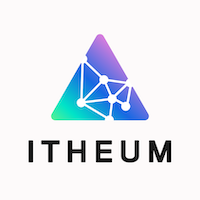

# Welcome to Creative Origin - Ethical and Responsible AI Alliance

- [Welcome to Creative Origin - Ethical and Responsible AI Alliance](#welcome-to-creative-origin---ethical-and-responsible-ai-alliance)
- [Background](#background)
- [Purpose of the Alliance](#purpose-of-the-alliance)
- [Importance of the Alliance](#importance-of-the-alliance)
- [Responsibilities of Alliance Members](#responsibilities-of-alliance-members)
- [Choice of Alliance Platform](#choice-of-alliance-platform)
- [Join Creative Origin](#join-creative-origin)
- [References](#references)
- [Members](#members)

# Background

As we delve further into the AI Internet era, our engagement with technology becomes increasingly data-driven and interconnected, unveiling vast possibilities and challenges. This transformation is emphasized by principles such as transparency, accountability, and fairness, which are core to the [AI Act [1]](https://artificialintelligenceact.com/). These principles are essential in combating misinformation and fostering innovation while respecting intellectual property and sustaining public trust in media. In this transformative era, open, decentralized approaches are vital for innovation and steadfastly upholding AI's ethical use.

# Purpose of the Alliance

Numbers Protocol, along with alliance partners, is spearheading a new alliance, similar in intent to other ethical AI alliances but distinct in its decentralized governance approach. This alliance is committed to advancing the ethical development of AI technologies, with a focus on enabling users to maintain control and ownership of their creative content. This collaborative platform will not only advocate for the responsible use of AI but also recommend open standards and open-source technologies that enhance user benefits. These standards are crucial for ensuring interoperability, security, and transparency across digital platforms, ultimately supporting a more robust and credible digital ecosystem.

# Importance of the Alliance

In an era where the authenticity of digital content is frequently questioned, this alliance is crucial for restoring trust in technology and integrity within digital media. It emphasizes "empowering individuals by improving their right to self-determination regarding their personal data and creative content," ensuring effective management of digital footprints. Importantly, existing ethical AI or provenance alliances are centralized and mainly governed by corporate interests. In contrast, this initiative promotes an open and decentralized approach, which is essential for meeting the expectations set by the creators and individuals. This initiative will develop tools and protocols that enhance the reliability of digital content and empower individuals maintain control and ownership of their data and creative content. This approach not only aligns with the guidelines set forth by the AI Act but also advances a more inclusive and equitable AI ecosystem.

# Responsibilities of Alliance Members

Alliance members are entrusted with several key responsibilities to ensure the integrity and effectiveness of our joint efforts in shaping the future of AI. First, members are committed to adhering to the principles outlined in the AI Act, which include maintaining high standards of robustness in AI systems.

Furthermore, members must prioritize maintaining control and ownership of users' data. This involves developing protocols, implementing mechanisms that ensure data privacy, allowing users to retain control over their personal and creative content. By doing so, the alliance champions user empowerment and trust, crucial elements in the widespread acceptance and success of AI technologies.

Lastly, members are committed to actively engaging in building protocols and technologies using a community-driven approach. This responsibility emphasizes collaboration and open-source development, facilitating innovation that is accessible, transparent, and beneficial to all stakeholders.

# Choice of Alliance Platform

The alliance has strategically chosen to host its platform on GitHub to leverage its robust, collaborative features and its widespread acceptance within the developer community. GitHub is renowned for promoting open-source projects, making it an ideal environment for our initiative, which prioritizes transparency and community involvement. By utilizing GitHub, we enable members worldwide to contribute easily to the project, enhancing the platform's reliability and innovativeness through collective expertise. Hosting on GitHub highlights our commitment to an open development ecosystem where contributions are welcomed and valued, driving forward our mission to create a more trustworthy and decentralized digital media landscape.

# Join Creative Origin

We welcome you to apply to join Creative Origin! Please follow these steps to apply:

1. Fork [this repository](https://github.com/creative-origin/.github).
1. Create a new branch.
1. Add a new Pull Request
   1. add your logo (200x200 PNG) to the `logos` directory
   1. add your company / organization / individual information to the `Members` section in `profile/README.md`

We will review your application as soon as possible.

# References

1. Artificial Intelligence Act, https://artificialintelligenceact.com/

# Members

<table>
  <tbody>
    <tr>
      <td align="center" valign="top" width="20%"><a href="https://numbersprotocol.io" target="_blank"> <b>Numbers Protocol</b></a> </td>
      <td align="center" valign="top" width="20%"><a href="https://www.instill.tech" target="_blank"> <b>Instill AI</b></a></td>
      <td align="center" valign="top" width="20%"><a href="https://www.facebook.com/pyroimage" target="_blank"> <b>Pyro Image</b></a></td>
      <td align="center" valign="top" width="20%"><a href="https://defiance.media" target="_blank"> <b>DeFiance Media</b></a></td>
      <td align="center" valign="top" width="20%"><a href="https://itheum.io" target="_blank"> <b>Itheum Protocol</b></a> </td>
    </tr>
    <tr>
      <td align="center" valign="top" width="20%"><a href="https://clickapp.com" target="_blank"> <b>Click Camera</b></a> </td>
      <td align="center" valign="top" width="20%"><a href="https://www.allfeat.com" target="_blank"> <b>Allfeat</b></a> </td>
      <td align="center" valign="top" width="20%"><a href="https://matters-lab.io/" target="_blank"> <b>Matters Lab</b></a> </td>
      <td align="center" valign="top" width="20%"><a href="https://like.co" target="_blank"> <b>LikeCoin</b></a> </td>
      <td align="center" valign="top" width="20%"><a href="https://www.vaisual.com" target="_blank"> <b>vAIsual</b></a> </td>
    </tr>
    <tr>
      <td align="center" valign="top" width="20%"><a href="https://orangeweb3.com" target="_blank"> <b>Orange Web3</b></a> </td>
       <td align="center" valign="top" width="20%"><a href="https://gitdata.ai/" target="_blank"> <b>GitData.AI</b></a> </td>
    </tr>
  </tbody>
</table>
